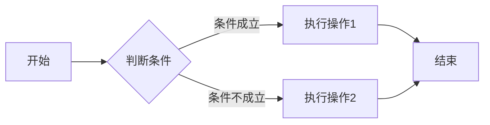
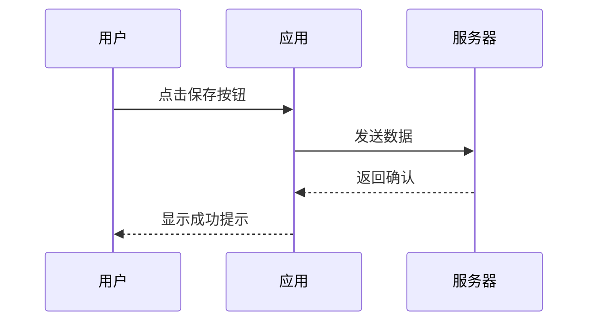
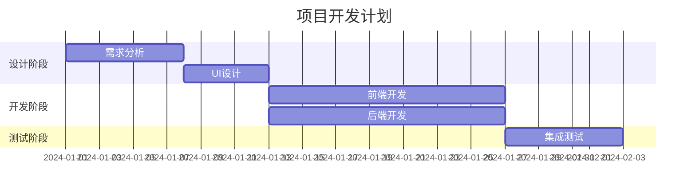
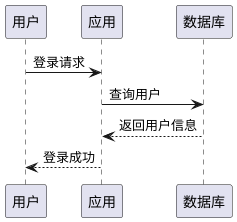
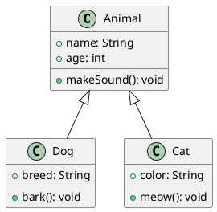
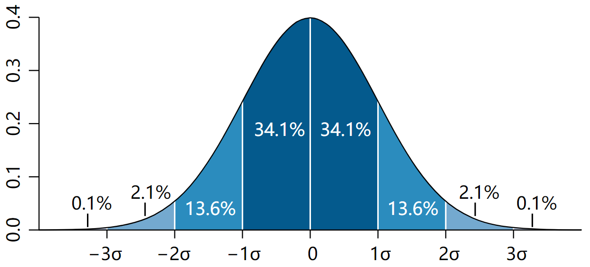

# MarkRefine 功能展示

本文档展示 MarkRefine 支持的所有 Markdown 特性和扩展功能。

**快速导航：** [基础语法](#基础语法) | [扩展功能](#扩展功能) | [文档元素](#文档元素) | [高级功能](#高级功能) | [跨文件](./test-wavedrom.md#wavedrom-时序图测试)

---

## 基础语法

### 段落和文本样式

这是一个普通段落。MarkRefine 支持以下文本样式：

- **粗体文本** - 使用 `**内容**`
- *斜体文本* - 使用 `*内容*`
- ~~删除线~~ - 使用 `~~内容~~`
- ***粗斜体*** - 使用 `***内容***`

### 列表

#### 无序列表

- 第一项
- 第二项
  - 嵌套项 1
  - 嵌套项 2
- 第三项

#### 有序列表

1. 第一步
2. 第二步
   1. 子步骤 A
   2. 子步骤 B
3. 第三步

#### 任务列表

- [x] 已完成的任务
- [ ] 未完成的任务
- [x] 支持勾选状态的任务列表

---

## 扩展功能

### 数学公式

#### 行内公式

爱因斯坦质能方程：$E = mc^2$

勾股定理：$a^2 + b^2 = c^2$

#### 块级公式

$$
\int_{-\infty}^{+\infty} e^{-x^2} dx = \sqrt{\pi}
$$

$$
\sum_{i=1}^{n} x_i = x_1 + x_2 + \cdots + x_n
$$

$$
\begin{pmatrix}
a & b \\
c & d
\end{pmatrix}
\begin{pmatrix}
x \\
y
\end{pmatrix}
=
\begin{pmatrix}
ax + by \\
cx + dy
\end{pmatrix}
$$

### 代码高亮

#### 行内代码

使用 `console.log()` 输出信息。

#### 代码块

```javascript
// JavaScript 示例
function fibonacci(n) {
  if (n <= 1) return n;
  return fibonacci(n - 1) + fibonacci(n - 2);
}

console.log(fibonacci(10)); // 55
```

```python
# Python 示例
def quicksort(arr):
    if len(arr) <= 1:
        return arr
    pivot = arr[len(arr) // 2]
    left = [x for x in arr if x < pivot]
    middle = [x for x in arr if x == pivot]
    right = [x for x in arr if x > pivot]
    return quicksort(left) + middle + quicksort(right)

print(quicksort([3, 6, 8, 10, 1, 2, 1]))
```

```rust
// Rust 示例
fn main() {
    let message = "Hello, MarkRefine!";
    println!("{}", message);
}
```

### Mermaid 图表

#### 流程图



#### 时序图



#### 甘特图



### WaveDrom 时序图

WaveDrom 是一个用于绘制数字时序波形图的工具，常用于硬件设计文档。

#### 简单时钟信号

```wavedrom
{ signal: [
  { name: 'clk', wave: 'p....' },
  { name: 'data', wave: 'x3.x', data: ['A', 'B'] },
  { name: 'req', wave: '0.1..0.1' },
  { name: 'ack', wave: '1....1' }
]}
```

#### 带标注的总线时序图

```wavedrom
{ signal: [
  { name: 'clk', wave: 'P.......' },
  { name: 'addr', wave: 'x=.=.=.=x', data: ['A1', 'A2', 'A3', 'A4'] },
  { name: 'data', wave: 'x.=.=.=.x', data: ['D1', 'D2', 'D3', 'D4'] },
  { name: 'rd', wave: '0.1..0.1.' },
  { name: 'wr', wave: '0....10.' },
  {},
  { name: 'ack', wave: '1....01.' }
],
  head: {
    text: 'Memory Read/Write Cycle',
    tick: 0
  }
}
```

### PlantUML 图表

PlantUML 是另一种图表语言，支持更多图表类型（需要安装 Java 运行时）。

#### 时序图



#### 类图



### 图片

#### 本地图片



{align=right, width=400}

这是一张本地图片，使用相对路径引用。

#### 网络图片


网络图片通过 URL 引用。

#### 带标题的图片

使用 `<figure>` 标签可以创建带标题的居中图片：

<figure markdown="span">
  { width="300" }
  <figcaption>这是一个示例图片标题</figcaption>
</figure>

支持以下属性：
- `markdown="span"` - 图片居中显示
- `{ width="300" }` - 控制图片宽度
- `<figcaption>` - 图片标题，在图片下方居中显示

---

## 文档元素

### 表格

| 功能 | 描述 | 支持状态 |
|------|------|----------|
| 数学公式 | LaTeX 公式渲染 | ✅ 支持 |
| 代码高亮 | 语法着色 + 行号 | ✅ 支持 |
| Mermaid | 流程图/时序图等 | ✅ 支持 |
| PlantUML | UML 图表（需 Java） | ✅ 支持 |
| WaveDrom | 数字时序波形图 | ✅ 支持 |
| 图片 | 本地/网络图片 | ✅ 支持 |
| 导出 PDF | 生成 PDF 文件 | ✅ 支持 |
| 导出 HTML | 生成 HTML 文件 | ✅ 支持 |

### 引用块

> 这是一段引用文本。
>
> 引用可以包含多行，并且支持 **粗体**、*斜体* 等样式。
>
> > 这是嵌套引用。

### 提示框（Admonition）

支持多种类型的提示框，用于突出显示重要信息。支持两种语法格式：

#### 缩进语法（推荐）

使用 4 个空格缩进表示内容范围：

!!! note 注意
    这是一个普通的注意提示。
    可以包含多行内容，支持 **Markdown** 格式。

!!! tip 技巧
    这是一个有用的技巧或建议。

!!! warning 警告
    这是一个警告信息，需要注意。

!!! danger 危险
    这是一个严重警告，需要特别小心。

#### 结束标记语法

使用 `!!!` 作为结束标记：

!!! info 信息
这是一个一般性的信息说明。
!!!

!!! success 成功
操作已成功完成。
!!!

#### 不带标题的形式

标题默认为类型名称（使用缩进语法）：

!!! note
    不带自定义标题的注意提示。

!!! tip
    不带自定义标题的技巧提示。
    标题默认显示为 "tip"。

### 水平分割线

上方内容

---

下方内容

### 脚注

这是一个带有脚注的示例[^1]。

[^1]: 这是脚注的内容，可以包含详细说明或参考资料。

### 缩写

HTML 和 CSS 是网页开发的基础技术。

*[HTML]: HyperText Markup Language
*[CSS]: Cascading Style Sheets

### 定义列表

定义列表用于术语和定义的对应关系：

Markdown
:   一种轻量级标记语言，由约翰·格鲁伯（John Gruber）创建。

HTML
:   超文本标记语言，用于创建网页的标准标记语言。
:   HTML5 是当前的最新版本。

CSS
:   层叠样式表，用于描述文档的呈现方式。

特性
:   支持多个定义
:   每个定义以 `:` 开头

---

## 高级功能

### 目录

[[toc]]

### 上下标

- 上标：X^2^, H~2~O
- 化学式：C~6~H~12~O~6~

### 表情符号

支持常用表情，使用 `:emoji_name:` 语法：

#### 表情类

:smile: :laughing: :blush: :smiley: :relaxed:
:wink: :stuck_out_tongue: :grinning: :innocent:

#### 手势类

:thumbsup: :thumbsdown: :ok_hand: :v: :clap: :wave:

#### 心形类

:heart: :yellow_heart: :green_heart: :blue_heart: :purple_heart: :broken_heart:

#### 其他常用

:rocket: :fire: :star: :sparkles: :bug: :memo: :warning: :heavy_check_mark:

### Tabbed 标签页

Material for MkDocs 风格的标签页语法，支持多个内容块切换显示：

=== "Python"

    ``` python
    def hello():
        print("Hello, World!")
    
    if __name__ == "__main__":
        hello()
    ```

=== "JavaScript"

    ``` javascript
    function hello() {
        console.log("Hello, World!");
    }
    
    hello();
    ```

=== "Go"

    ``` go
    package main
    
    import "fmt"
    
    func main() {
        fmt.Println("Hello, World!")
    }
    ```

**说明：**
- 使用 `=== "标签名"` 开头，内容需缩进 4 个空格
- 至少需要两个标签才能生效
- PDF 导出时所有标签内容按顺序显示

### 链接

- [MarkRefine GitHub 仓库](https://github.com)
- [Markdown 语法指南](https://markdownguide.org)

---

## 使用提示

### 导出功能

1. **导出 HTML** - 点击工具栏的"导出 HTML"按钮，可以生成独立的 HTML 文件
2. **导出 PDF** - 点击工具栏的"导出 PDF"按钮，使用系统打印对话框保存为 PDF

### 主题切换

点击右上角的主题图标，可以在浅色和深色模式之间切换。

### 文件操作

- **打开文件** - 支持 .md, .markdown, .txt 文件
- **保存文件** - 保存为 .md 格式

---

**开始创建你的 Markdown 文档吧！** 🚀
