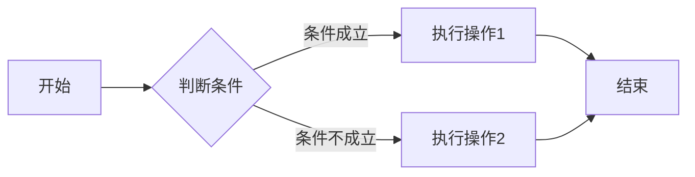
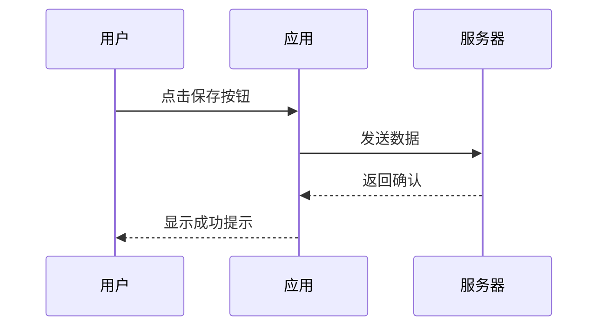
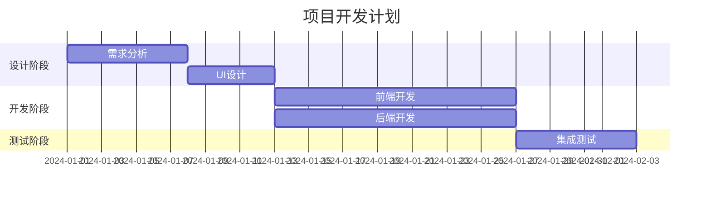

# MD2PDF 功能展示

本文档展示 MD2PDF 支持的所有 Markdown 特性和扩展功能。

---

## 基础语法

### 标题

# 一级标题
## 二级标题
### 三级标题
#### 四级标题
##### 五级标题
###### 六级标题

### 段落和文本样式

这是一个普通段落。MD2PDF 支持以下文本样式：

- **粗体文本** - 使用 `**内容**`
- *斜体文本* - 使用 `*内容*`
- ~~删除线~~ - 使用 `~~内容~~`
- ***粗斜体*** - 使用 `***内容***`

### 列表

#### 无序列表

- 第一项
- 第二项
  - 嵌套项 1
  - 嵌套项 2
- 第三项

#### 有序列表

1. 第一步
2. 第二步
   1. 子步骤 A
   2. 子步骤 B
3. 第三步

#### 任务列表

- [x] 已完成的任务
- [ ] 未完成的任务
- [x] 支持勾选状态的任务列表

---

## 扩展功能

### 数学公式

#### 行内公式

爱因斯坦质能方程：$E = mc^2$

勾股定理：$a^2 + b^2 = c^2$

#### 块级公式

$$
\int_{-\infty}^{+\infty} e^{-x^2} dx = \sqrt{\pi}
$$

$$
\sum_{i=1}^{n} x_i = x_1 + x_2 + \cdots + x_n
$$

$$
\begin{pmatrix}
a & b \\
c & d
\end{pmatrix}
\begin{pmatrix}
x \\
y
\end{pmatrix}
=
\begin{pmatrix}
ax + by \\
cx + dy
\end{pmatrix}
$$

### 代码高亮

#### 行内代码

使用 `console.log()` 输出信息。

#### 代码块

```javascript
// JavaScript 示例
function fibonacci(n) {
  if (n <= 1) return n;
  return fibonacci(n - 1) + fibonacci(n - 2);
}

console.log(fibonacci(10)); // 55
```

```python
# Python 示例
def quicksort(arr):
    if len(arr) <= 1:
        return arr
    pivot = arr[len(arr) // 2]
    left = [x for x in arr if x < pivot]
    middle = [x for x in arr if x == pivot]
    right = [x for x in arr if x > pivot]
    return quicksort(left) + middle + quicksort(right)

print(quicksort([3, 6, 8, 10, 1, 2, 1]))
```

```rust
// Rust 示例
fn main() {
    let message = "Hello, MD2PDF!";
    println!("{}", message);
}
```

### Mermaid 图表

#### 流程图



#### 时序图



#### 甘特图



---

## 文档元素

### 表格

| 功能 | 描述 | 支持状态 |
|------|------|----------|
| 数学公式 | LaTeX 公式渲染 | ✅ 支持 |
| 代码高亮 | 语法着色 | ✅ 支持 |
| Mermaid | 图表绘制 | ✅ 支持 |
| 导出 PDF | 生成 PDF 文件 | ✅ 支持 |
| 导出 HTML | 生成 HTML 文件 | ✅ 支持 |

### 引用块

> 这是一段引用文本。
>
> 引用可以包含多行，并且支持 **粗体**、*斜体* 等样式。
>
> > 这是嵌套引用。

### 水平分割线

上方内容

---

下方内容

### 脚注

这是一个带有脚注的示例[^1]。

[^1]: 这是脚注的内容，可以包含详细说明或参考资料。

### 缩写

HTML 和 CSS 是网页开发的基础技术。

*[HTML]: HyperText Markup Language
*[CSS]: Cascading Style Sheets

### 定义列表

术语一
:   这是术语一的定义说明。

术语二
:   这是术语二的定义说明。
:   一个术语可以有多个定义。

---

## 高级功能

### 目录

[[toc]]

### 上下标

- 上标：X^2^, H~2~O
- 化学式：C~6~H~12~O~6~

### 表情符号

支持常用表情：:smile: :heart: :thumbsup: :rocket:

### 链接

- [MD2PDF GitHub 仓库](https://github.com)
- [Markdown 语法指南](https://markdownguide.org)

---

## 使用提示

### 导出功能

1. **导出 HTML** - 点击工具栏的"导出 HTML"按钮，可以生成独立的 HTML 文件
2. **导出 PDF** - 点击工具栏的"导出 PDF"按钮，使用系统打印对话框保存为 PDF

### 主题切换

点击右上角的主题图标，可以在浅色和深色模式之间切换。

### 文件操作

- **打开文件** - 支持 .md, .markdown, .txt 文件
- **保存文件** - 保存为 .md 格式

---

**开始创建你的 Markdown 文档吧！** 🚀
